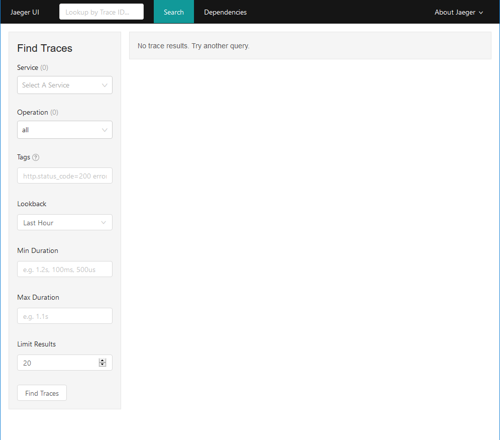
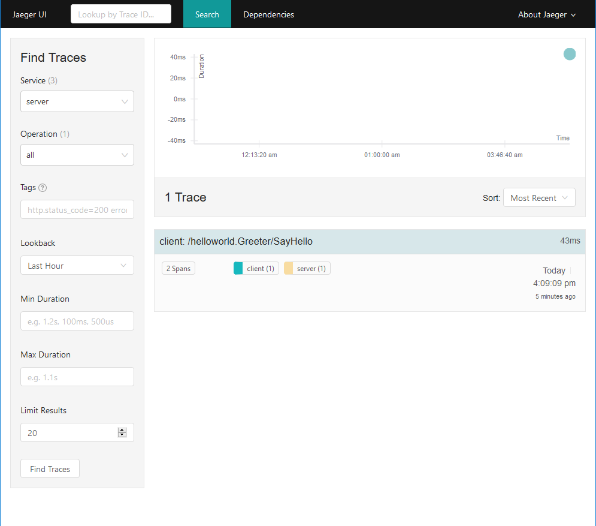
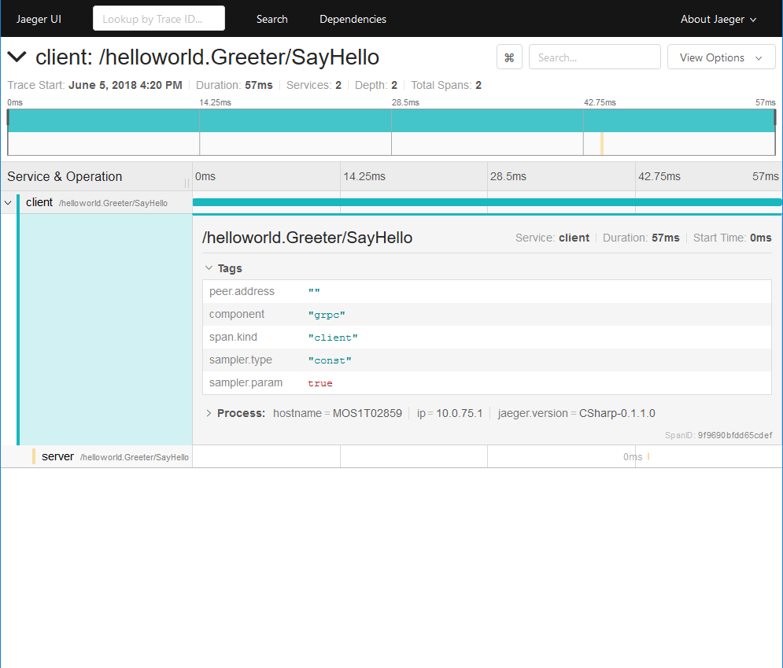

# OpenTracing gRPC Tutorial - C#

This tutorial will give a brief introduction into how to add tracing to your gRPC code using OpenTracing.

## Recommended Reading

It's also helpful to checkout the [OpenTracing Tutorial for C# (opentracing-tutorial)][opentracing-tutorial] first or afterwards, which also uses [jaeger-client-csharp] as OpenTracing implementation.

For more details on the C# API of OpenTracing, have a look at [opentracing-csharp]. But most of the API is already handled in [opentracing-tutorial].

Having followed the [gRPC Quickstart for C#](https://grpc.io/docs/quickstart/csharp.html) also helps understanding.

## Installation

The tutorial is using CNCF Jaeger (https://github.com/jaegertracing/jaeger) as the tracing backend, which be run from a [Docker](https://www.docker.com/get-docker) image. You will still be able to follow most of the tutorial, even without Docker. So don't worry if you can't or don't want to install it.

For running the code, you will need the [.NET Core SDK](https://www.microsoft.com/net/download). The code can be written with any text editor and run from the command line.

For easier development, use the free IDE [Visual Studio Code](https://code.visualstudio.com/Download?wt.mc_id=DotNet_Home) available for Windows, Linux and macOS. For full language support including smart code completion and debugging, get the [C# extension](https://marketplace.visualstudio.com/items?itemName=ms-vscode.csharp) for Visual Studio Code. Alternatively, if you already have Visual Studio 2017 or higher, .NET Core SDK is already included.

## Download the example

The example is based on an updated version of the [gRPC Quickstart example for .NET Core](https://github.com/grpc/grpc/tree/master/examples/csharp/helloworld-from-cli). You can not use the example code from `grpc/grpc` without updating the NuGet packages and upgrading the code from `.netcoreapp1.0` to `.netcoreapp2.0`.

You’ll need a local copy of the example code to work through this quickstart. Download the example code from our Github repository (the following command clones the entire repository, but you just need the examples for this quickstart):

```bash
> # Clone the repository to get the example code:
> git clone https://github.com/opentracing-contrib/csharp-grpc
> cd csharp-grpc/getting_started
```

## Run the example

Either open the solution `Greeter.sln` with Visual Studio or Xamarin Studio or just build it using the .NET Core SDK. 
It's easier to use the command line since we need to have two running instances.

### Run the server

```bash
> cd GreeterServer
> dotnet run
```

### Run the client (in another terminal)

```bash
> cd GreeterClient
> dotnet run
```

## Install additional NuGet packages

Add the following NuGet packages as dependencies to the shared `GreeterShared` project. This can be done through the .NET Core SDK using the following commands.

```bash
> dotnet add GreeterShared package OpenTracing.Contrib.Grpc
> dotnet add GreeterShared package Jaeger
> dotnet add GreeterShared package Microsoft.Extensions.Logging.Console
```

`OpenTracing.Contrib.Grpc` only relies on `OpenTracing` and no specific implementation. We will use `Jaeger` for our examples, but you are free to use whatever library fits your needs best.

`Jaeger` internally uses the `Microsoft.Extensions.Logging` framework. We will add the console provider from `Microsoft.Extensions.Logging.Console` to show what's happening inside `Jaeger` on the command line.

## Get the tracer ready

Create a new class `TracingHelper.cs` in the shared `GreeterShared` project. This will allow us to create an `OpenTracing.ITracer` instance implemented by `Jaeger.Tracer`.

```csharp
using Jaeger;
using Jaeger.Samplers;
using Microsoft.Extensions.Logging;

namespace GreeterShared
{
    public static class TracingHelper
    {
        public static Tracer InitTracer(string serviceName, ILoggerFactory loggerFactory)
        {
            Configuration.SamplerConfiguration samplerConfiguration = new Configuration.SamplerConfiguration(loggerFactory)
                .WithType(ConstSampler.Type)
                .WithParam(1);

            Configuration.ReporterConfiguration reporterConfiguration = new Configuration.ReporterConfiguration(loggerFactory)
                .WithLogSpans(true);

            return (Tracer)new Configuration(serviceName, loggerFactory)
                .WithSampler(samplerConfiguration)
                .WithReporter(reporterConfiguration)
                .GetTracer();
        }
    }
}
```

## Add the tracing interceptor

Now we just need to add our tracing interceptors to the server and client side. To create a new tracer, 
we need to call `TracingHelper.IniTracer` with a service name and an `ILoggerFactory` instance.

Remember that we added `Microsoft.Extensions.Logging.Console` as NuGet dependency? This allows as to create a 
new `ILoggerFactory` that logs to the command line.

### Instrumenting the server side

Intercepting the server side is done by intercepting a `Grpc.Core.ServerServiceDefinition`. This can be achieved by adding
the following lines to the beginning of our `Main` method.

```csharp
ILoggerFactory loggerFactory = new LoggerFactory().AddConsole();
Tracer tracer = TracingHelper.InitTracer("server", loggerFactory);
ServerTracingInterceptor tracingInterceptor = new ServerTracingInterceptor(tracer);
```

Now that we have the `tracingInterceptor`, we can replace our `Greeter.BindService(new GreeterImpl())` with `Greeter.BindService(new GreeterImpl()).Intercept(tracingInterceptor)`. 
Our `Server` instantiation will look like this:

```csharp
Server server = new Server
{
    Services = { Greeter.BindService(new GreeterImpl()).Intercept(tracingInterceptor) },
    Ports = { new ServerPort("localhost", Port, ServerCredentials.Insecure) }
};
```

That's it! Our server is now fully instrumented for tracing! Let's start our server and see the output.

```bash
> cd GreeterServer
> dotnet run
info: Jaeger.Configuration[0]
      Initialized Tracer(ServiceName=server, Version=CSharp-0.1.1.0, Reporter=CompositeReporter(Reporters=RemoteReporter(Sender=UdpSender(UdpTransport=ThriftUdpClientTransport(Client=127.0.0.1:6831))), LoggingReporter(Logger=Microsoft.Extensions.Logging.Logger`1[Jaeger.Reporters.LoggingReporter])), Sampler=ConstSampler(True), IPv4=167791361, Tags=[jaeger.version, CSharp-0.1.1.0], [hostname, MOS1T02859], [ip, 10.0.75.1], ZipkinSharedRpcSpan=False, ExpandExceptionLogs=False)
Greeter server listening on port 50051
Press any key to stop the server...
```

You will see a lot more output, and also `Jaeger` is showing us that he is waiting for work. 
So what's missing is the client side. We could already run the client and would see `Jaeger` at work, 
but let's add our client instrumentation first for the full tracing experience.

### Instrumenting the client side

Intercepting the client side is done by intercepting a `Grpc.Core.Channel`. This can be achieved by adding
the following lines to the beginning of our `Main` method.

```csharp
ILoggerFactory loggerFactory = new LoggerFactory().AddConsole();
Tracer tracer = TracingHelper.InitTracer("client", loggerFactory);
ClientTracingInterceptor tracingInterceptor = new ClientTracingInterceptor(tracer);
```

Looks pretty similar, right? We just replaced `ServerTracingInterceptor` with `ClientTracingInterceptor` and changed the `serviceName`.

Now to intercepting the `Channel`. Right now we our client instantiation looks as follows:

```csharp
var client = new Greeter.GreeterClient(channel);
```

To intercept it, just add `.Intercept(tracingInterceptor)` as before.

```csharp
var client = new Greeter.GreeterClient(channel.Intercept(tracingInterceptor));
```

This is nice if we only have one client. But if we want to use the same traced channel for multiple clients, it's better to just get one instance.

```csharp
CallInvoker callInvoker = channel.Intercept(tracingInterceptor);
var client = new Greeter.GreeterClient(callInvoker);
```

You can now see, that the result of an intercepted channel is not a `Channel` instance but a `Grpc.Core.CallInvoker`. The good thing, 
`CallInvoker`s can be used everywhere where you used `Channel` before.

I assume you have the server still running? So let's start our client in a second terminal and watch both outputs more detailed.

#### Server output

```bash
> cd GreeterServer
> dotnet run
info: Jaeger.Configuration[0]
      Initialized Tracer(ServiceName=server, Version=CSharp-0.1.1.0, Reporter=CompositeReporter(Reporters=RemoteReporter(Sender=UdpSender(UdpTransport=ThriftUdpClientTransport(Client=127.0.0.1:6831))), LoggingReporter(Logger=Microsoft.Extensions.Logging.Logger`1[Jaeger.Reporters.LoggingReporter])), Sampler=ConstSampler(True), IPv4=167791361, Tags=[jaeger.version, CSharp-0.1.1.0], [hostname, MOS1T02859], [ip, 10.0.75.1], ZipkinSharedRpcSpan=False, ExpandExceptionLogs=False)
Greeter server listening on port 50051
Press any key to stop the server...
info: Jaeger.Reporters.LoggingReporter[0]
      Span reported: 323eb1d5c09dcb5f:ce7e54d70570f1ec:323eb1d5c09dcb5f:1 - /helloworld.Greeter/SayHello
```

#### Client output

```bash
> cd GreeterServer
> dotnet run
info: Jaeger.Configuration[0]
      Initialized Tracer(ServiceName=client, Version=CSharp-0.1.1.0, Reporter=CompositeReporter(Reporters=RemoteReporter(Sender=UdpSender(UdpTransport=ThriftUdpClientTransport(Client=127.0.0.1:6831))), LoggingReporter(Logger=Microsoft.Extensions.Logging.Logger`1[Jaeger.Reporters.LoggingReporter])), Sampler=ConstSampler(True), IPv4=167791361, Tags=[jaeger.version, CSharp-0.1.1.0], [hostname, MOS1T02859], [ip, 10.0.75.1], ZipkinSharedRpcSpan=False, ExpandExceptionLogs=False)
Greeting: Hello you
info: Jaeger.Reporters.LoggingReporter[0]
      Span reported: 323eb1d5c09dcb5f:323eb1d5c09dcb5f:0:1 - /helloworld.Greeter/SayHello
Press any key to exit...
```

## Visualization with Jaeger UI

As I told you in the introduction, there is a UI for visualizing our traces called `Jaeger UI`. 
If you have Docker, now would be the time start our container.

The following command starts our tracing endpoint (6831/udp) combined with our visualization (16686).

```bash
docker run --rm -d -p 6831:6831/udp -p 16686:16686 jaegertracing/all-in-one
```

Once the docker container is running, you can access the UI using http://localhost:16686.

You will see an empty UI which mainly shows you that no traces are available. Makes sense, since we just started our docker container.



So let's run our client again and see what we see once we refresh the page. The services drop-down is now populated and shows our services. 
Just select either `server` or `client` and click the `Find Traces` button.



We have one trace right now. We can see on the right the root span of our trace, which says `client: /helloworld.Greeter/SayHello`. 
That means, that the trace was started on the client side and the RPC called was `SayHello` of the `helloWorld.Greeter` service.

When you click anywhere on that trace (or on the dot in the chart above) you get into the detailed view. There you can see exactly 
the spans included in this trace. It shows all the tags that were generated automatically and also the process information about the client.



Two spans are very simple. Here is a more complex example from the great OpenTracing introduction [Take OpenTracing for a HotROD ride](https://medium.com/opentracing/take-opentracing-for-a-hotrod-ride-f6e3141f7941) from [@yurishkuro](https://github.com/yurishkuro/).


## What's next?

That's it for the instrumentation part. To get more information on how to use OpenTracing or Jaeger, I would recommend you (again) to have a look at [opentracing-tutorial] for examples on how to add child spans, logs, tags and baggage data.

[jaeger-client-csharp]: https://github.com/jaegertracing/jaeger-client-csharp/
[opentracing-csharp]: https://github.com/opentracing/opentracing-csharp
[opentracing-tutorial]: https://github.com/yurishkuro/opentracing-tutorial/tree/master/csharp